# World Gen: Verifiable 2D world generation with queryable game states

We turn text prompts into code-grounded 2D games where the world state and objects are stored in a deterministic database. All agent actions and success checks are executed as "tool calls" (i.e. queries) to this database. Inspired by how [MCP agents](https://www.anthropic.com/news/model-context-protocol) use strict tool calls to interact with apps, this framework applies the same logic to 2D gamesf by orcing the agent to interact exclusively through a deterministic database layer.

The primary goal of this project is to demonstrate that **AI generation can be grounded into tangible, stateful objects that code can verify**. We demonstrate that a fully grounded, verifiable world can be generated in **tens of seconds**, meaning we can meaningfully scale to "infinite" worlds that generate in real time.

See [Architecture Overview](#architecture-overview) to understand how it works.

> The following uses the prompt *"pull the lever to cross water over bridge terrain"* and is run with the frontend.

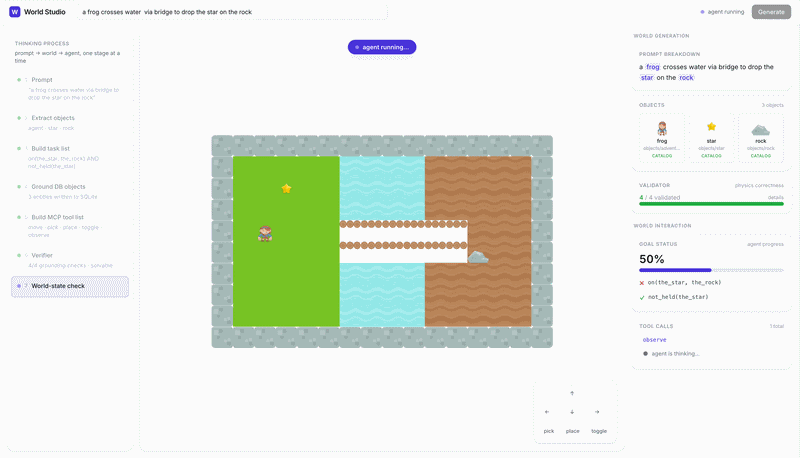

Other tasks:
| | |
| --- | --- |
| 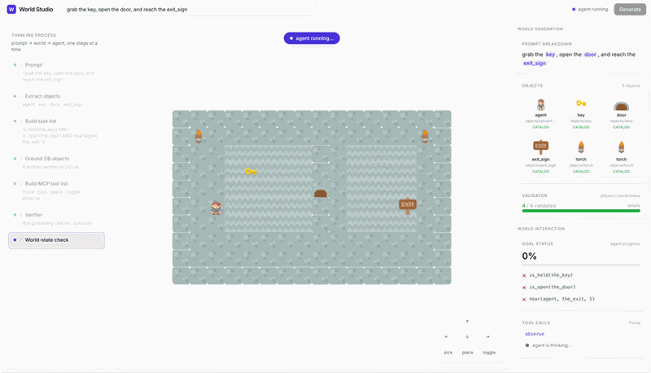<br>*"grab the key, open the door, and reach the exit_sign"* | 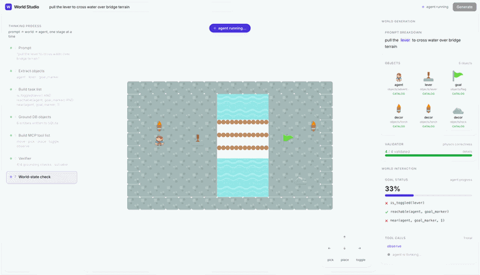<br>*"flip the switch and carry gold to the flag"* |

| | | |
| --- | --- | --- |
| 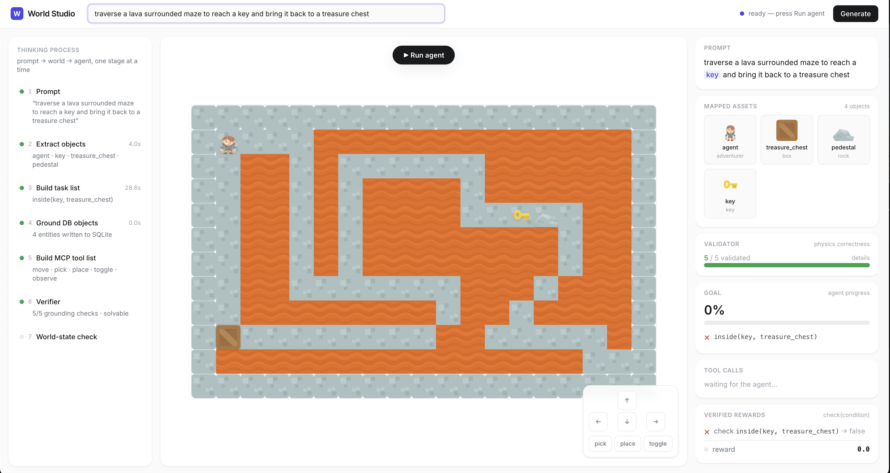<br>*"traverse a lava maze, pick up the key, and put it inside the crate"* | 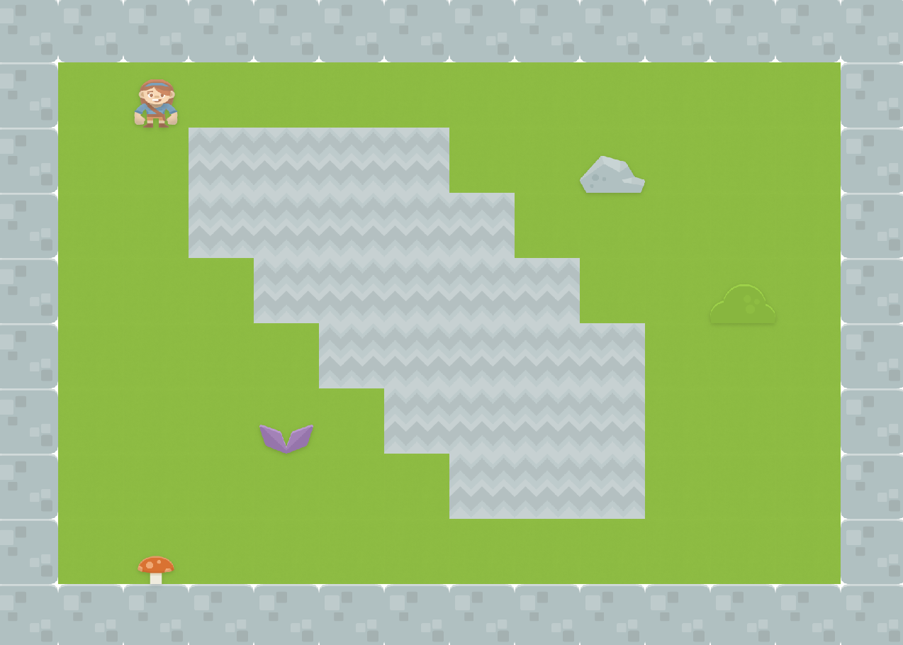<br>*"cross grass and dirt to place the mushroom next to the bush"* | 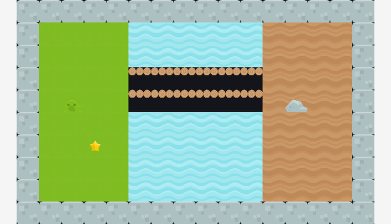<br>*"a frog crosses water via bridge to drop the star on the rock"* |
| 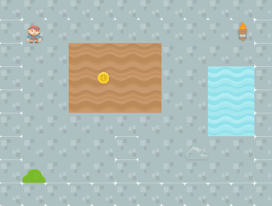<br>*"pick up the coin from the sand and place it on the rock"* | 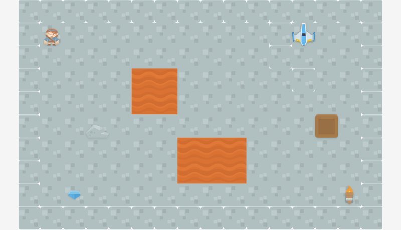<br>*"dock at the spaceship, pick up gem, and place it on the crate"* | 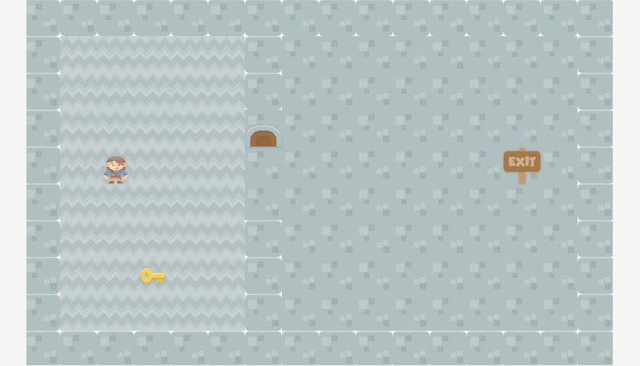<br>*"grab the key, open the door, and reach the exit_sign"* |

Across **39 logged generation runs**, **25 compiled and passed all verifier checks** (64%); the rest exhausted the 6-attempt retry budget. Simple pick-and-place tasks compile most reliably (100%) while layout-heavy prompts like lava mazes and dungeons are hardest (50%). The likely reasons are that the LLM struggles with geometry-based tasks. 

Normally, **procedural noise generation** is more effective for this, as proven by [Minecraft biome gen](https://minecraft.wiki/w/World_generation). We made this tradeoff to limit scope.

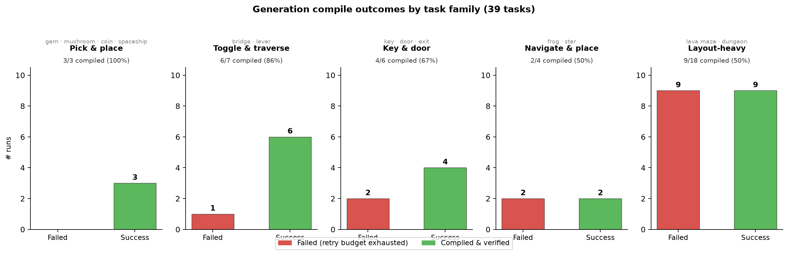

# Table of Contents

- [Getting Started](#getting-started)
- [Architecture Overview](#architecture-overview)
- [Building Blocks](#building-blocks)
  - [Stateful objects](#stateful-objects)
  - [World state represented as a Database](#world-state-represented-as-a-database)
  - [Tool-based interaction with world](#tool-based-interaction-with-world)
  - [Deterministic Verifier](#deterministic-verifier)
    - [Verifying world validity](#verifying-world-validity)
    - [Checking for game success](#checking-for-game-success)
- [Architecture](#architecture)
  - [World State Generator](#world-state-generator)
  - [Database design](#database-design)
  - [Tool Layer](#tool-layer)
  - [Verifier](#verifier)
- [Evaluations](#evaluations)
- [Results](#results)
  - [Baseline comparison](#baseline-comparison)
- [Next steps & Limitations](#next-steps--limitations)
- [Acknowledgements](#acknowledgements)

# Getting Started

1. Install once

```bash
python -m venv .venv && source .venv/bin/activate
pip install -r requirements.txt
pip install -e .
export ANTHROPIC_API_KEY=sk-...
```

2. Pick one of the two options below

> It's recommended to use a prompt that uses one of the objects in the `catalog.json` file since the model does not generate new assets for the scope of this project.

**Option A: frontend interface** (Recommended)

```bash
# Terminal 1: backend (holds ANTHROPIC_API_KEY)
pip install fastapi "uvicorn[standard]"
python -m worldgen.api
```

```bash
# Terminal 2: frontend
cd frontend
pnpm install
pnpm dev
```

Open `http://localhost:5173`. Type a prompt, press Generate, then press Run agent.

**Option B: Terminal**

```bash
# Run generation
python -m worldgen.core.agent

# or pass the prompt directly to the command line
python -m worldgen.core.agent "pick up the gem and put it inside the box"
```

3. Open `run.log` to inspect the world state over time

```text
2026-06-27T19:54:34+00:00
- agent action: move up
- world state:
  { "observe": { ... }, "get_objective": "...", "get_success": false }
```

# Architecture Overview

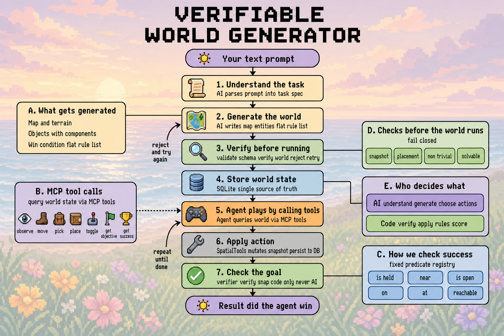

World Gen turns text prompts into playable 2D games where the entire world state is tracked in a database. This allows code to mathematically prove the game is valid before an agent ever takes an action.

WorldGen consists of three parts:

**Stochastic World Generation**: This module turns natural language prompts into a complete world specification (objects, terrain, rules). It excels at what LLMs do best: formulating the semantics, creative themes, and aesthetic layout of the world based on user intent.

**World state stored in queryable database**: This module takes the generator's output and writes it into a local SQLite database. It serves as the single, absolute source of truth where all entities, rules, and world primitives are stored as rigid relational rows.

**Deterministic Verifier**: This module runs fixed Python rule checks over the database rows. It validates placement, non-trivial objectives, and whether win-condition entities exist before the runtime engine starts.

# Building Blocks

A world is built from four layers that stack on each other like legos. This grounds each generation process into checkable steps.

### 1. Stateful objects

Instead of generating everything from scratch, we explicitly ground generation into explicit **object** and **action** primitives, outlined below.

**Object primitives** are entities in the game: rocks, placeable keys, agents. Sprites come from a fixed Kenney catalog (`catalog.json`); the model picks asset names from that list.


| `holder` | walkable terrain | `pickable` | `openable` | `container` |
| --- | --- | --- | --- | --- |
| <br>object that can carry items | <br>tile to stand on | <br>object that can be picked up | <br>object that can be opened | <br>object others can be placed in |


Each object has a state. A key has the `pickable` component; a chest has `container` and `openable`. Walls are non-walkable terrain tiles — the agent cannot pass through them.

**Action primitives** are `move`, `pick`, `place`, and `toggle` — the only ways the agent can change the world. Read-only queries (`observe`, `get_objective`, `get_success`) inspect state without mutating it.

### 2. World state represented as a Database

The world state is stored in **SQLite**. A fixed `schema.sql` defines the baseline tables; `World.instantiate()` writes the LLM spec into them:

- `meta` — grid size, tick, prompt, success flags
- `map_tiles` — one row per terrain cell
- `entities` — every object and its position
- `entity_state` — mutable flags (`is_held`, `is_open`, …)
- `holding` — what the agent carries
- `objective` — flat list of win-condition rules (JSON)

The current state is aggregated into a JSON snapshot from SQLite. The agent writes to this JSON first; then those updates are written back to the database:

```python
{
  "grid": {"w": 14, "h": 10},
  "walls": {(0, 0), (0, 1), (1, 0), ...},          # non-walkable cells
  "entities": {
    "agent":      {"type": "agent", "components": ["transform", "holder"],
                   "sprite": "world-gen/assets/objects/adventurer.png"},
    "key":        {"type": "key",   "components": ["transform", "pickable"],
                   "sprite": "world-gen/assets/objects/key.png"},
    "crate":      {"type": "crate", "components": ["transform", "container", "openable", "blocking"],
                   "sprite": "world-gen/assets/objects/crate.png"},
  },
  "pos":     {"agent": (2, 5), "key": (3, 2), "crate": (10, 5)},
  "flags":   {"agent": {}, "key": {"is_held": False}, "crate": {"is_open": False}},
  "holding": {"agent": None},
  "rules": [
    {"check": "inside",   "args": ["key", "crate"]},
    {"check": "not_open", "args": ["crate"]},
  ],
}
```

### 3. Tool-based interaction with world

The agent interacts with the world through a fixed set of MCP tool calls. **Actions** mutate state; **reads** inspect it.

1. `move(direction)` — walk one cell (up / down / left / right)
2. `pick(entity_id)` — pick up an adjacent pickable item
3. `place(target)` — drop held item onto a surface or current cell
4. `toggle(entity_id)` — open, close, or flip a nearby object
5. `observe()` — full scene graph: entities, walls, objective, per-clause status
6. `get_objective()` — human-readable win condition
7. `get_success()` — `verifier.verify(snap)`; true when every rule passes

### 4. Deterministic Verifier

**Verifying world validity**

We can check if the world is solvable via test cases. If the world passes all test cases, then it's valid. The test cases are as follows:

1. **Is the objective reachable?**: Can the agent navigate to the target destination and is the goal state possible?
2. **Are all entities legally placed?** Every entity sits inside the grid bounds, not on a wall tile, and no two entities occupy the same cell.
3. **Is the world non-trivial?** The win condition must be false at the start. A world where the rules are already satisfied at spawn is rejected — there has to be something left to solve.
4. **Is the rule set well-formed?** The rules generated by the LLM must already exist in the fixed set of rules. If it fails, then the output was hallucinated.

##### Checking for game success

We can check if the agent reached a success state with a tool call

```python
# Example: The key must be in the chest AND the chest must be closed
verifier.verify(snap)
```

# Architecture

```text
world-gen/
├── api.py                  # talks to the frontend
├── conf/config.yaml
├── assets/                 # default 2d sprites
└── core/
    ├── server.py
    ├── render.py               # draws the world with pygame
    ├── agent.py                # agent calls tools to interact with db
    │
    ├── utils/
    │   └── llm.py
    │
    ├── generator/
    │   ├── generate_world.py   #   generates world state / sqlite db
    │   ├── prompts.py
    │   ├── generate_layout.py  #   pads terrain map to a rectangle
    │   └── generate_assets.py  #   catalog asset lookup
    │
    └── runtime/
        ├── engine.py
        ├── world.py
        ├── tools.py        #   agent tools to interact with the db
        ├── verifier.py     #   verifies validity of world
        └── schema.sql      #   the shape of the world state data
```

### World State Generator

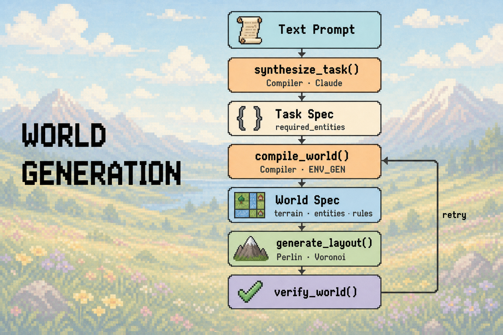

**Stage 1: Generate the task list**
The ordered sub-goals the world must support.

```json
{
  "task_id": "seal_gem_in_crate",
  "difficulty": "medium",
  "task_description": "A gem rests in a stone room bordered by lava. Pick it up, carry it to the crate, place it inside, and close the lid.",
  "required_entities": ["agent", "gem", "crate"],
  "required_tiles": ["stone", "wall", "lava"],
  "objective_summary": "the gem is inside the crate and the crate is closed"
}
```

**Stage 2: Compile the world specification**
The LLM draws the full terrain map and places every entity by coordinate; the verifier then proves it solvable before it is stored.

```json
{
    "dimensions": [12, 10],
    "terrain": {
      "legend": {
        "#": {"tile": "wall",  "walkable": false, "sprite": "wall"},
        ".": {"tile": "floor", "walkable": true,  "sprite": "stone"},
        "~": {"tile": "lava",  "walkable": false, "sprite": "lava"}
      },
      "map": ["############",
              "#..........#",
              "#..#####.~~#",
              "#........~~#",
              "############"]
    },
    "entities": [
      {"id": "agent", "type": "agent", "asset": "adventurer", "components": ["transform", "holder"], "x": 1, "y": 1},
      {"id": "gem",   "type": "gem",   "asset": "gem",        "components": ["transform", "pickable"], "x": 9, "y": 3},
      {"id": "crate", "type": "crate", "asset": "crate",      "components": ["transform", "container", "openable", "blocking"], "x": 2, "y": 3}
    ],
    "rules": [
      {"check": "inside",   "args": ["gem", "crate"]},
      {"check": "not_open", "args": ["crate"]}
    ]
  }
```

### Database design

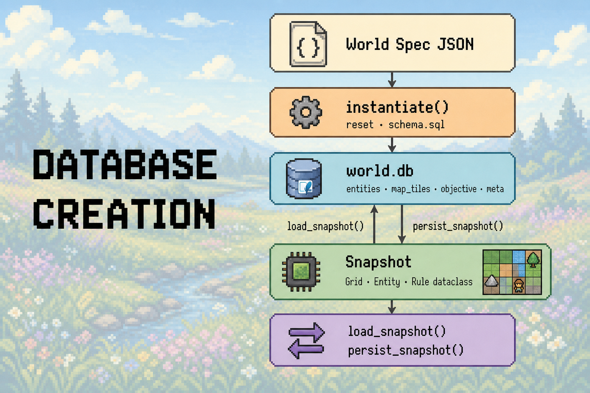

**Step 1: Deterministic baseline schema**

We assume that all games have the same basic databases. When a new world is generated, `schema.sql` is set as the default tables.

**Stage 2: Write the spec**

A function runs sql queries to upload the world specification elements into the baseline databases from step 1.

**Stage 3: Create JSON snapshot**

Importantly, tools never directly read from the database. A snapshot combines rows from each table into a single JSON that represents the current state of the world.

### Tool Layer

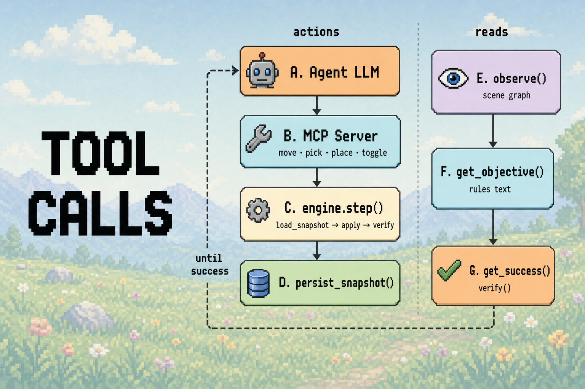

**Steps**

1. First, an LLM plans what move it wants to take. It can only select moves from the selected list of tool calls in SpatialTools
2. Next, these moves are applied via the MCPAgent which updates the JSON snapshot.
3. Finally, this new JSON is pushed to the DB

### Verifier

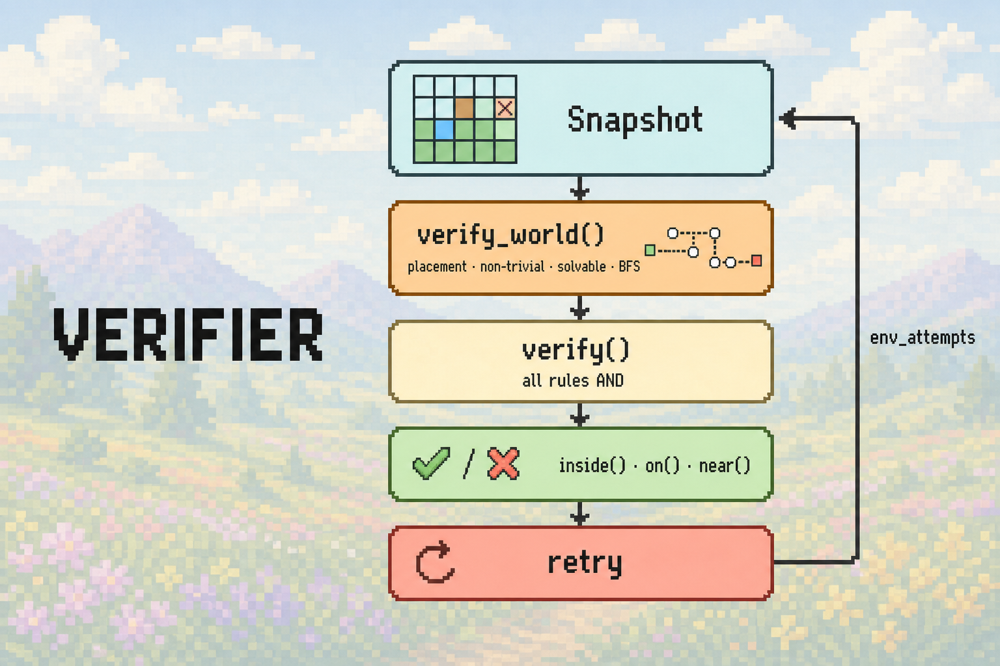

1. On world creation: `verify_world()` runs placement, non-trivial, and BFS reachability checks before the agent starts
2. On each agent step: `verify(snap)` checks whether every rule in the snapshot currently passes

# Evaluations

| Example | Limitation |
| ------- | ---------- |
| 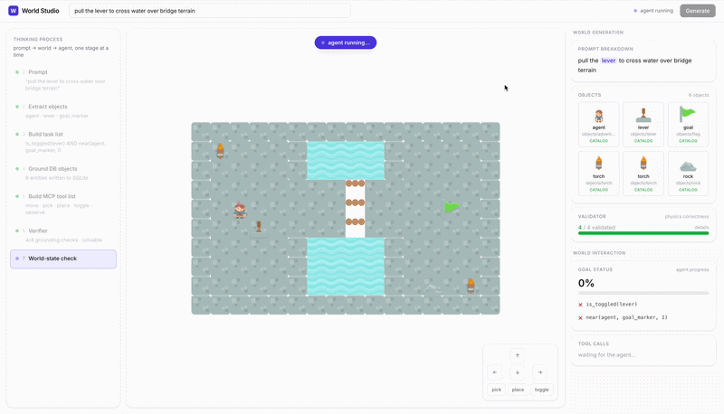 | Model may struggle with full physics understanding (i.e. the bridge should be horizontal). This may deserve more hand-crafted test cases. |
| 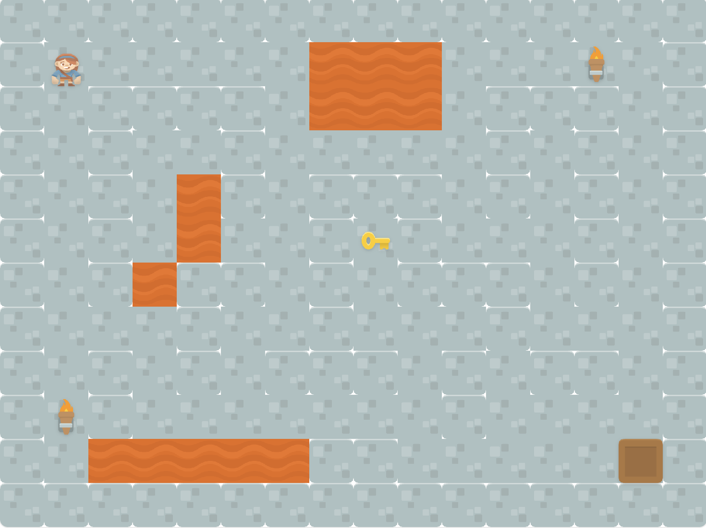 | Model struggles with complex geometric formations. Needs to be grounded with procedural noise generation to avoid hallucinated geometries |
| 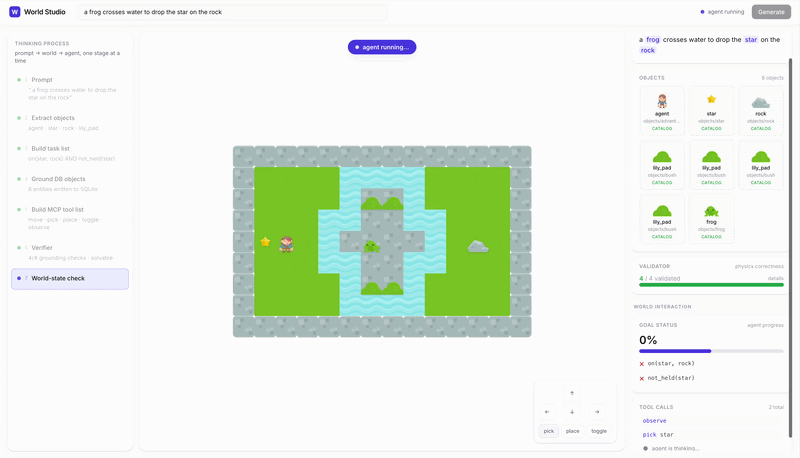 | This was an earlier example where the goal is unreachable (before test cases). The agent still successfully avoids the river (unwalkable block) |

# Results

**TLDR: generated worlds are schema-valid and rule-grounded before use, by code** (see chart above).
Measured with 8 prompt benchmarks using Opus 4.8 for compiling the world spec and Sonnet 4.6 for MCP tool calls.


| metric                    | value                                                                                              |
| ------------------------- | -------------------------------------------------------------------------------------------------- |
| worlds compiled           | 25 / 39 logged runs (64%); 100% of successes pass all verifier checks                              |
| solvability               | BFS reachability to all goal entities at compile time; win state checked per step via `verify()`     |
| check coverage            | all rule checks exercised across the prompts                                                       |
| generation latency        | about 10 to 18 s per world (2 LLM calls)                                                           |
| agent success (our suite) | successful solves on the door, bridge, and lever agent demos |
| sprite grounding          | 21 of 21 entities used a real labeled asset the model chose                                        |


### Baseline comparison


| System                                                              | Domain    | Verifier   | Solvable?  | Generation time | Generation cost   |
| ------------------------------------------------------------------- | --------- | ---------- | ---------- | --------------- | ----------------- |
| World-Gen                                                           | 2D        | fixed code | guaranteed | ~10-18 s           | ~30 cents |
| Agent World Model / EnvScaler [↗](https://arxiv.org/abs/2601.05808) | Web apps  | LLM judge  | no         | n/r             | ~$1               |
| Genie 3                                                             | pixels    | VLM        | no         | real-time 23-24 fps      | GPU inference     |


# Next steps & Limitations

Things I would do if I had more time

- **Infinite procedural generation**. We have demonstrated that generation can run fast. We can continuously generate new chunks of the world as the agent navigates by using the current world state as a prior.
- **Enhancing environment diversity**: This phase focuses on verifiability. There is room to create more diverse worlds with added procedural generation methods like optimized Perlin noise, etc.
- **3D.** The world spec is engine agnostic, so the same verifier could drive a 3D physics backend.
- **Room for more determinism**: There are steps that could theoretically be deterministic that we replaced with an LLM for time. For example, we could use [part of speech tagging](https://spacy.io/usage/linguistic-features) to extract keywords/nouns from the prompt instead of using an LLM.

# Acknowledgements

- [Agent World Model](https://arxiv.org/pdf/2602.10090) for baseline architecture which I adapted into 2D games.
- [mcp-agent](https://github.com/lastmile-ai/mcp-agent) for MCP server.
- Sprites from [Kenney](https://kenney.nl).

